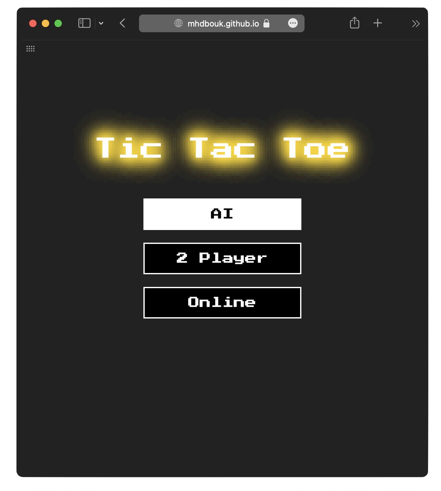
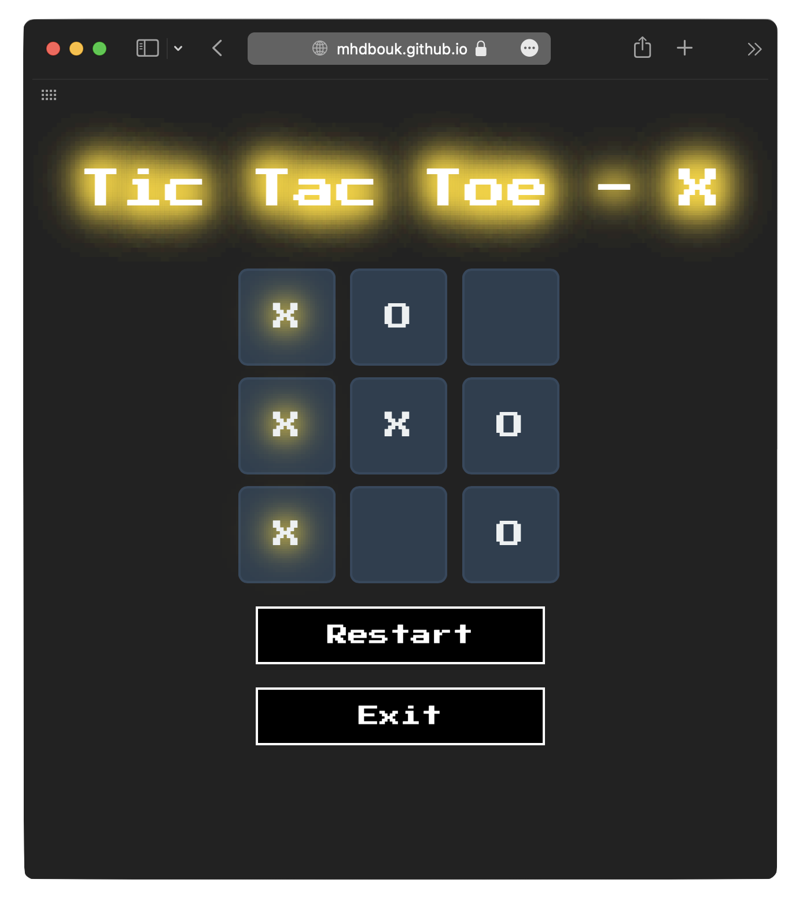

# TicTacToe Blazor Web Assembly with MAUI Support


  
  


Welcome to the TicTacToe Blazor Web Assembly project with an AI opponent! This is a simple implementation of the classic Tic-Tac-Toe game using Blazor Web Assembly, now with MAUI Blazor support. In this version, you'll be challenging an AI opponent in the timeless battle of X's and O's on both desktop and mobile.  The AI is now unbeatable!

## Table of Contents

- [Demo](#demo)
- [Features](#features)
- [Blog Posts](#blog-posts)
- [Getting Started](#getting-started)
- [Usage](#usage)
- [Contributing](#contributing)
- [License](#license)

## Demo

You can try out the live demo of the TicTacToe game [here](https://mhdbouk.github.io/tictactoe-blazor/).

## Features

- Work on Browser, Mobile, and Native Desktop app using MAUI.
- Play against an AI opponent.
- Interactive game board.
- Real-time feedback on game status.
- Multiplayer (Co-op)
- Online Multiplayer _**WIP**_

## Blog Posts

For a detailed explanation of how this project was built, check out our blog posts [Let's Build a Tic Tac Toe Game with Blazor WebAssembly!](https://mdbouk.com/lets-build-a-tic-tac-toe-game-with-blazor-webassembly/) and [Bringing Blazor to Desktop and Mobile with MAUI](https://mdbouk.com/bringing-blazor-to-desktop-and-mobile-with-maui/)


## Getting Started

To get started with this TicTacToe Blazor Web Assembly project locally, follow these steps:

1. **Clone the repository:**

    ```bash
    git clone https://github.com/mhdbouk/tictactoe-blazor.git
    cd tictactoe-blazor
    ```

2. **Build and run the project:**

   Make sure you have the [.NET 9 SDK](https://dotnet.microsoft.com/download/dotnet/9.0) installed.

    ```bash
    dotnet build
    dotnet run
    ```

3. **Open in your browser:**

   Open your preferred web browser and navigate to `https://localhost:7205`.

## Usage

- Select the playing mode (AI, 2 Players, Online)
- When selecting AI, you play as "X" and the AI opponent plays as "O".
- Click on the empty cells of the game board to place your move.
- The AI opponent will make its move automatically.
- The game will automatically detect a win, loss, or draw and display the result.
- To start a new game, click on the Restart button.

## Contributing

Contributions are welcome! If you'd like to contribute to this project, please follow these steps:

1. Fork the repository.
2. Create a new branch for your feature or bug fix.
3. Make your changes and commit them with descriptive commit messages.
4. Push your changes to your fork.
5. Create a pull request to the `main` branch of this repository.

## License

This project is licensed under the [MIT License](LICENSE).
